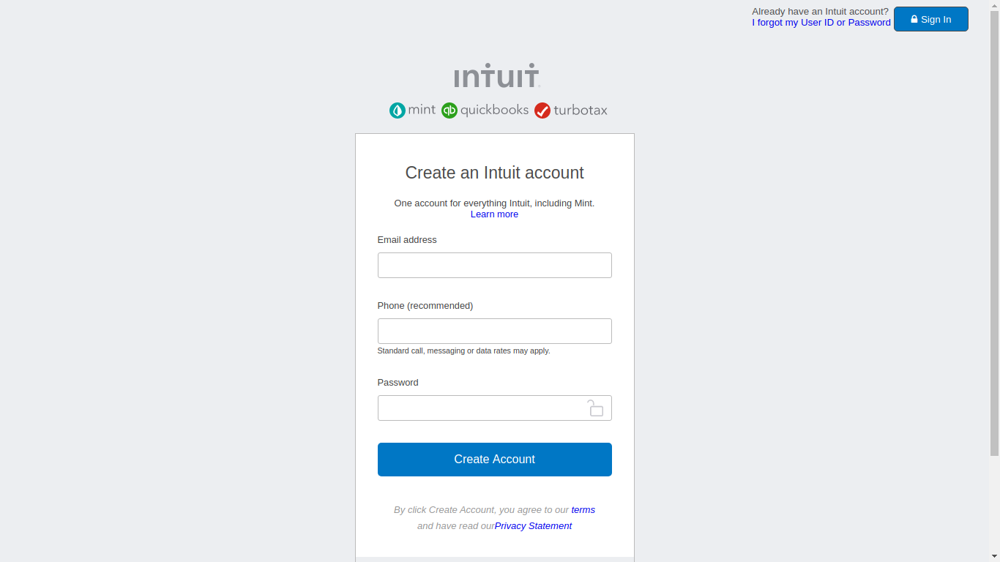

# Project-2: mint.com's signup page  - HTML forms

> This project consists of building an HTML document that matches the appearance of mint.com's signup page.

Use of vectors of the icon on signup with css and all of the page it's responsive.

## Built With

- HTML, CSS.
## Live Demo

[Live Demo Link](https://rawcdn.githack.com/hemant-soni-vst-au4/HTML-forms/e426ad17f96181f9d31c0405e046bab3b6e57c84/index.html)

## Authors

👤 **Hemant soni**

- Github: [@githubhandle](https://github.com/hemant-soni-vst-au4)
- Twitter: [@twitterhandle](https://twitter.com/abdelperez11)
- Linkedin: [linkedin](https://www.linkedin.com/in/hemant-soni-97427b193/)

👤 **Muhammad Arslan**

- Github: [@githubhandle](https://github.com/arslanbisharat)
- Twitter: [@twitterhandle](https://twitter.com/arslan_bisharat)
- Linkedin: [linkedin](https://www.linkedin.com/in/muhammad-arslan-2020bb156)

## 🤝 Contributing

Contributions, issues and feature requests are welcome!

Feel free to check the [issues page]().

## Show your support

Give a ⭐️ if you like this project!

